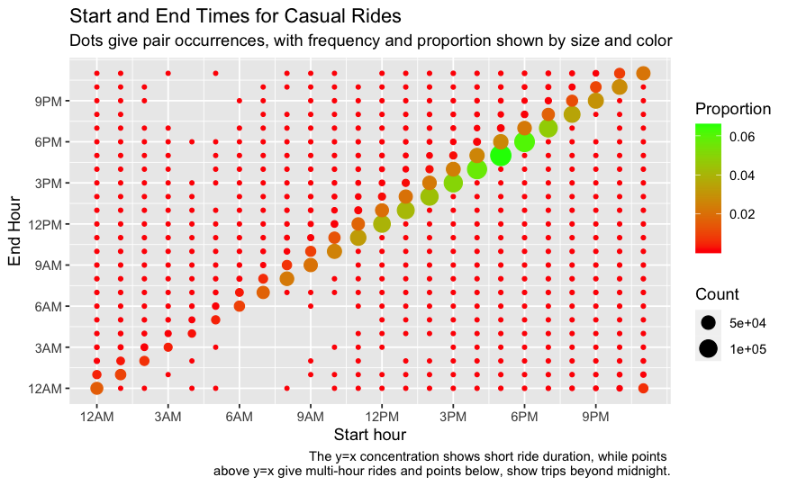

# Cyclistic Bike-Share Analysis
## Author: Daniel Mallia
### Date: September 2023

This repository contains all of my work on the Cyclistic bike-share case
study, performed as a "capstone" project for Google's excellent Data Analytics
certificate program on Coursera.

My R notebook is hosted here: https://dmallia17.github.io/CyclisticBike-ShareAnalysis.html

I chose to work on the analysis using R, given that even just a single year's
data would be too large for spreadsheet software and while SQL would have
been another great option, R and R Notebook let me accomplish all of the
processing, cleaning, analysis and visualization in one place, where it's
very transparent and reproducible!

### Contents:
- The ```CyclisticBike-ShareAnalysis.Rmd``` R Notebook contains my end-to-end
work. As above, it is hosted [here](https://dmallia17.github.io/CyclisticBike-ShareAnalysis.html).
- ```DataREADME.md``` contains a description of all data files. These are not
stored in this repository, but can easily be recreated using the R Notebook.
- ```DataChangelog.md``` contains a more detailed description of what changed
between data files.

The below is an example of just one of the fun plots I created for my analysis and
visualization, considering how casual riders use bikes by start and end hours
of their rides:

